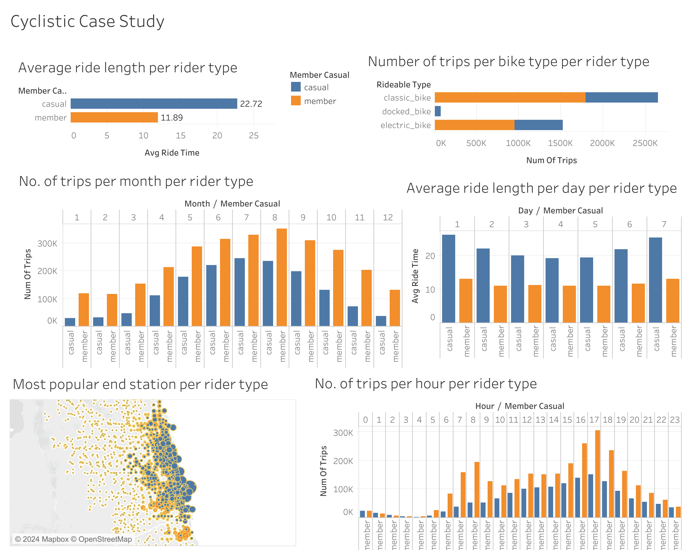
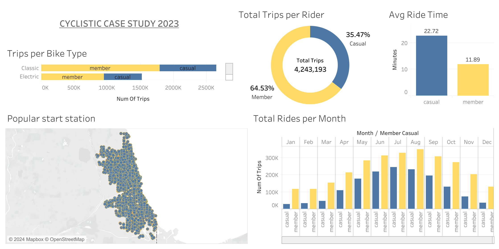

# Google Data Analytics Captsone: Cyclistic Case Study

Welcome!

This is my capstone project for Google's Data Analytics Professional Certificate. Presented in the final course, it is used to culminate and showcase all that has been learned throughout this program into a case study analysis. The case study lays out a real-world business problem to be tackled using the 6 Phase Analysis methodology (Ask, Prepare, Process, Analyze, Share, Act) that has been a focal point of the program.

Working as a data analyst within Cyclistic's marketing team, I am given the role of reporting key insights into how customers with annual subscriptions differ from customers purchasing single ride/daily passes in order to help craft and implement a targeted marketing strategy to convert these casual customers to annual Cyclistic members. 

## About the company:
Cyclistic: A bike-share program that features more than 5,800 bicycles and 600 docking stations. Cyclistic sets itself apart by also offering reclining bikes, hand tricycles, and cargo bikes, making bike-share more inclusive to people with disabilities and riders who can’t use a standard two-wheeled bike.

## Business Task
Explore how annual members and casual riders utilize Cyclistic bikes to uncover valuable insights into their distinct preferences and patterns of usage and make data-driven strategic marketing decisions for Cyclistic.

## Stakeholders
* **Lily Moreno:** The director of marketing and your manager. Moreno is responsible for the development of campaigns and initiatives to promote the bike-share program. These may include email, social media, and other channels.
* **Cyclistic marketing analytics team:** A team of data analysts responsible for collecting, analyzing, and reporting data that helps guide Cyclistic marketing strategy. You joined this team six months ago and have been busy learning about Cyclistic’s mission and business goals and how you, as a junior data analyst, can help Cyclistic achieve them.
* **Cyclistic executive team:** The notoriously detail-oriented executive team will decide whether to approve the recommended marketing program.

## Data Integrity and Credibility
The fictional company Cyclistic was created for this capstone project. The datasets are appropriate and have been made available by Motivate International Inc. under this [license](https://divvybikes.com/data-license-agreement).

## Data Cleaning and Analysis using SQL :
Here are the steps that I followed during this phase:
1.  Combined all the tables into one data table
2.	Check for null and duplicates
3.	Cleaned the data
4.	Additional columns and data transformation
5.	Extract data for analysis

To check the step by step data cleaning and analysis process, [click here.](https://github.com/RitoChak/Google-Data-Analytics-Capstone-Complete-a-Case-Study/blob/c614eec25c20181a134dd8db92118e602d1e4fb7/Google%20Data%20Analytics%20Capstone%3A%20Complete%20a%20Case%20Study.md)

## Tableau Dashboard for visualization:

To see this dashboard in detail : [Click here](https://public.tableau.com/views/CYCLISTICCASESTUDY2023/Dashboard2?:language=en-GB&:display_count=n&:origin=viz_share_link)

## Conclusions
* As 64.53% of Cyclistic users are annual members, this is already a significant portion that are already committed annual members.
* Annual members are inclined to employ the bike-sharing service for their daily commute, as the majority of their trips occur on weekdays and have shorter average trip durations.
* Summer is the season where trips peak, likely due to favorable weather and road conditions during this season.

## Recommendations
* Given the company's goal of maximizing annual memberships, design marketing campaigns that specifically target casual riders, emphasizing the benefits of annual memberships, such as cost savings and convenience.
* Since classic bikes are preferred by both groups, promote the advantages of using classic bikes for various purposes. Consider incentives or promotions for members who exclusively use classic bikes.
* Capitalize on the peak in summer usage by launching targeted marketing campaigns during this season. Highlight the pleasant weather and ideal biking conditions. Consider seasonal promotions or partnerships.
* Explore the possibility of offering more flexible membership options (such as membership during summer and weekend membership) to cater to the diverse usage patterns observed.
* Implement advertisements at popular stations, especially those near coastlines and parks. Tailor these promotions to attract both casual riders and potential annual members.
